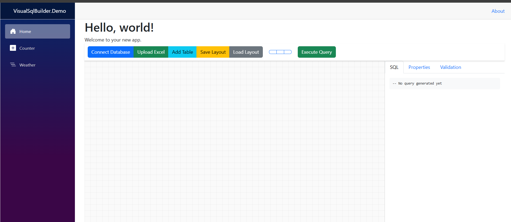

# Visual SQL Query Builder

A **Blazor Server**–based **visual SQL query builder**, inspired by SQL Server’s query designer.  
Easily drag & drop tables, build relationships, apply filters, and generate SQL queries from SQL Server or Excel workbooks.

---

## 📸 Application Screenshot

*(Example: Tables with drag/drop relationships, join lines in red/blue, filters, and generated SQL preview)*

---

## ✨ Features
- Load tables from **SQL Server** (via connection string) or **Excel** (ClosedXML).
- Auto-detect relationships from SQL Server **foreign keys**.
- Drag & drop table relationships with join types (INNER, LEFT, RIGHT, FULL).
- **Primary** (red) & **Secondary** (blue) relationships visualization.
- Add/remove tables & columns with predefined metadata (CreatedBy, ModifiedBy, etc.).
- Add **computed columns**, **group by**, and **aliases**.
- Domain grouping: visually group tables with borders.
- Validation rules (e.g., enforce unique emails) that can be run on table data.
- Save & reload query layouts (tables, columns, relationships).
- Excel imports enhanced with **Azure OpenAI** to auto-suggest relationships & queries.
- Packaged as a **Razor Class Library** (RCL) for easy integration with other Blazor apps.

## 🛠 Tech Stack
- **.NET 8.0**, **Blazor Server**, **Bootstrap 5**
- **C#**, **SVG + JS interop** for drag/drop
- **SQL Server** (Microsoft.Data.SqlClient)
- **Excel** via ClosedXML
- **Azure OpenAI** for smart query/relationship suggestions
